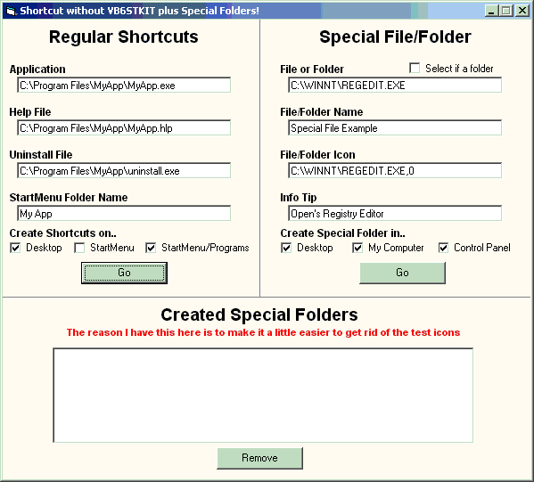



## Shortcuts and Special Folders

### Description

An update to my previous submission. Create shortcuts without the VB6STKIT.DLL file. Also create special folders/files in My Computer, Desktop, or the Control Panel, which cannot be deleted or renamed. Also the screenshot has some messed up colors, dont ask me why, cause i have no idea...
 
### More Info
 

             |
---                |---
**Submitted On**   |2002-03-21 02:58:44
**By**             |[Johneboy](https://github.com/Planet-Source-Code/PSCIndex/blob/master/ByAuthor/johneboy.md)
**Level**          |Beginner
**User Rating**    |4.2 (25 globes from 6 users)
**Compatibility**  |VB 6\.0
**Category**       |[VB function enhancement](https://github.com/Planet-Source-Code/PSCIndex/blob/master/ByCategory/vb-function-enhancement__1-25.md)
**World**          |[Visual Basic](https://github.com/Planet-Source-Code/PSCIndex/blob/master/ByWorld/visual-basic.md)
**Archive File**   |[Shortcuts\_640183212002\.zip](https://github.com/Planet-Source-Code/johneboy-shortcuts-and-special-folders__1-32914/archive/master.zip)

